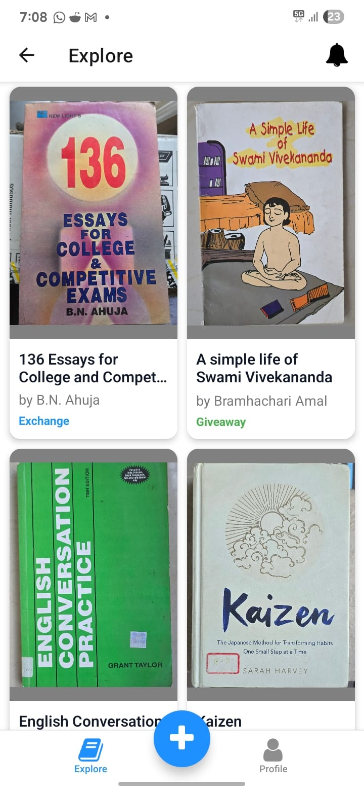

# 📚 BookBarter - Your Community Book Exchange App


A mobile app that makes it easy to give away or exchange books with others around you. Built with modern technologies for a seamless experience.

---

## 🌟 Key Features

| Feature                   | Description                                         |
| ------------------------- | --------------------------------------------------- |
| 📖 **Book Listings**      | Browse and search books available in your community |
| 📸 **Multi-image Upload** | Add multiple photos of your books                   |
| 🔄 **Exchange System**    | Request books for exchange or giveaway              |
| 🔔 **Request Management** | Track pending, accepted, and rejected requests      |
| 📚 **Book History**       | View your completed exchanges and giveaways         |
| 🔒 **Secure Auth**        | Supabase-powered authentication                     |

---

## 🛠 Tech Stack

### Frontend

[](https://reactnative.dev/)
[](https://expo.io/)
[](https://www.typescriptlang.org/)
[](https://www.nativewind.dev/)

### Backend & Database

[](https://supabase.io/)
[](https://www.postgresql.org/)

### State Management & Utilities

[](https://tanstack.com/query/latest)

---

## 📂 Project Structure

```bash
BookBarter/
├── src/
│   ├── app/               # Screens and navigation (Expo Router)
│   ├── components/        # Shared components like BookCard, Button
│   ├── api/               # React Query hooks and Supabase API logic
│   ├── constants/         # Book conditions, tags, etc.
│   ├── contexts/          # Context Providers like Auth Context
│   ├── lib/               # Supabase client setup and helpers
│   └── global.css         # Tailwind styles via NativeWind
├── assets/                # Fonts, images, icons
├── supabase/              # Supabase SQL files and setup
├── tailwind.config.js     # Tailwind configuration
├── app.json               # Expo app configuration
├── tsconfig.json          # TypeScript configuration
└── README.md              # You are here
```

---

## 🚀 Getting Started

### Prerequisites

* Node.js (v16 or later)
* Expo CLI (`npm install -g expo-cli`)
* Supabase Project (with credentials)

### Installation

```bash
git clone https://github.com/your-username/BookBarter.git
cd BookBarter
npm install
```

### Environment Variables

Create a `.env` file:

```env
SUPABASE_URL=your-url
SUPABASE_ANON_KEY=your-anon-key
```

### Run the App

```bash
npx expo start
```

---

## 📝 To-Do / Upcoming

* Full profile pages
* Messaging between users
* Notifications system
* Location based book listings
* UI/UX improvements

---

## 📸 Screenshots
<p align="center">
  
  
  
  
</p>

More screenshots can be found in the `assets/screenshots` directory.
## 🤝 Contributing

Contributions are welcome!

```bash
git checkout -b feature/YourFeature
commit -m "Add YourFeature"
git push origin feature/YourFeature
```

Then open a Pull Request.

---

## 📄 License

Distributed under the MIT License.

---
